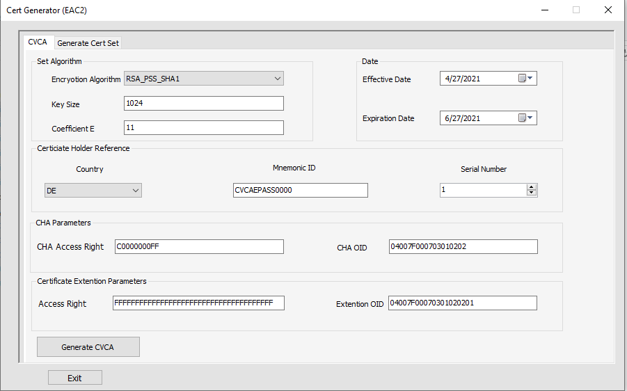
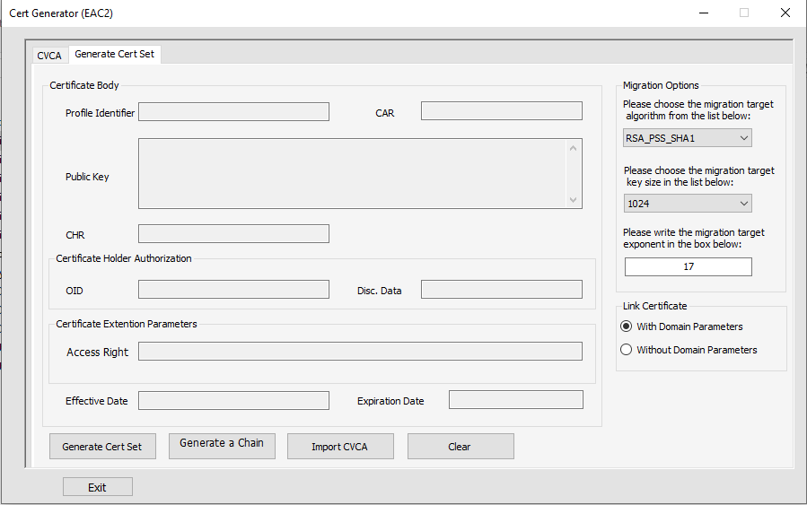

# EAC-Certificate-Generator
This application is written by me to generate wrong CVCA, DV and IS certificates according to the BSI documents. These generated certificates help to test different parts of a smart card's Operating System. This application allows to generate certificates using different encryption algorithms (RSA &amp; Elliptic curve). Due to the copy-right, I am not allowed to publish the hard codes.
 

  
   

